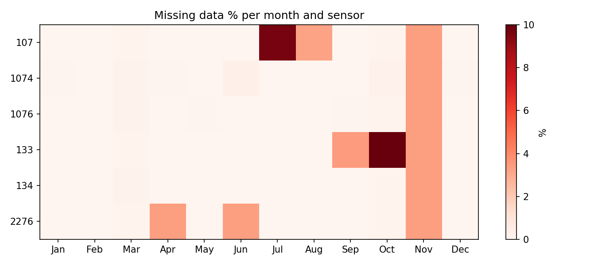

# Gothenburg Traffic Simulation

An interactive model of central Gothenburg, developed as a Chalmers student
project using traffic counts supplied by Göteborgs Stad. Explore measured 2025
traffic, a 2027 forecast, and saved SUMO scenarios on the map. Run new date
simulations and road closure analyses on your own computer.

[Open the map](https://gust050.github.io/gothenburg-traffic-sim/) ·
[Get started](#get-started) · [Architecture](ARCHITECTURE.md)

> **Online preview:** GitHub Pages serves the map and saved results. It cannot
> run Python, SUMO, or a new simulation. The app marks those actions as local.

## Main workflows

| Local app | What you can do |
| --- | --- |
| **Simulera datum** | Build and inspect traffic for a chosen date or up to seven consecutive days. |
| **Vägavstängning** | Select roads and analyse a closure window or a multi-day work period. Candidate costs are screened before selected SUMO checks; results remain provisional decision support. |

The map also plays historical and forecast traffic. Its road-colour support
index describes proximity to sensors and, for scenarios, variation across runs.
It is **not** a probability that the predicted traffic is correct.


*Measured source data, not a simulation result or an app screenshot.*

<details>
<summary>View missing observations by month and sensor</summary>



*Missing observations remain missing in validation; they are not filled with
simulated traffic.*

</details>

## Get started

**View existing results:** [open the hosted map](https://gust050.github.io/gothenburg-traffic-sim/).
No installation is needed for the preview. On macOS or Linux, a local copy of
the same viewer can also start with Python's standard library:

```bash
git clone https://github.com/GUST050/gothenburg-traffic-sim.git
cd gothenburg-traffic-sim
python3 serve.py
```

Open the address printed by the server and keep that terminal open. On macOS,
`start.command` is a Finder shortcut for this viewer. The viewer can show the
tracked map and saved scenarios without installing the simulation packages.

**Run new simulations:** use a macOS or Linux environment with Python 3.11 or
3.12, Git, enough disk space for generated data, and access to the project's
input data. From the repository root:

```bash
python3 -m venv .venv
. .venv/bin/activate
python -m pip install -r requirements.txt
python build_sumo_net.py
python -m dirsplit.predict
python serve.py
```

`requirements.txt` installs the scientific Python packages and declares
`eclipse-sumo`. Set `SUMO_HOME` to select an existing SUMO installation. The
network and direction-split steps are required on a fresh clone because their
outputs under `sumo/` are generated locally and are not stored in Git. The
first simulation may also need to fetch source data and build a candidate
route pool. In the app, use **Simulera datum** or **Vägavstängning**. Runtime
depends on the requested dates and available cached demand; no fixed duration
is promised.

<details>
<summary>Windows setup (optional, via WSL)</summary>

Install [Ubuntu 24.04 in WSL](https://documentation.ubuntu.com/wsl/latest/guides/install-ubuntu-wsl2/)
from an administrator PowerShell, then restart Windows if prompted and create
your Ubuntu user:

```powershell
wsl --install -d Ubuntu-24.04
```

In the Ubuntu terminal, clone into your Linux home directory and use the
optional launcher. It prepares a local virtual environment, SUMO network and
direction split on the first run; later runs reuse them:

```bash
sudo apt update && sudo apt install -y git python3 python3-venv
git clone https://github.com/GUST050/gothenburg-traffic-sim.git ~/gothenburg-traffic-sim
cd ~/gothenburg-traffic-sim
./start-wsl.sh
```

Open the printed `http://localhost:PORT` address in your Windows browser and
keep Ubuntu open while using **Simulera datum** or **Vägavstängning**. Stop with
Ctrl+C. For later starts, run `cd ~/gothenburg-traffic-sim && ./start-wsl.sh`
in Ubuntu. [Microsoft documents Windows-to-WSL localhost access](https://learn.microsoft.com/en-us/windows/wsl/networking)
and [recommends storing Linux projects in the WSL filesystem](https://learn.microsoft.com/en-us/windows/wsl/filesystems).
This route is prepared in the repository but has not yet been tested on a
Windows machine.

The launcher caps interactive worker processes to the logical CPUs actually
available inside WSL. PFE calibration uses that cap; scenario checks use at
most three workers, and independent daily closure search at most eight. WSL
normally gets all Windows logical CPUs but [defaults to half the host RAM](https://learn.microsoft.com/en-us/windows/wsl/wsl-config),
so a large analysis can still run out of memory on another computer. The
worker cap changes parallelism, not the simulation or validation rules.

</details>

| Environment | Current support |
| --- | --- |
| Hosted map | Browser-only preview. Checked in the project browser; other browsers and devices have not all been tested. |
| macOS | Local viewer and simulation workflows have been exercised here. `start.command` is macOS-only. |
| Linux | CI runs lint and tests on Ubuntu with Python 3.11 and 3.12. Full interactive SUMO workflows have not been verified on every Linux setup. |
| Windows via WSL | Optional Ubuntu launcher included; Windows browser can use the WSL localhost server. Full date and closure workflows still need testing on Windows hardware. |
| Native Windows | Local server and simulation are not supported: the code uses POSIX file locks, process groups, and fork workers. The hosted map remains available in a browser. |

## Scope and evidence

The model covers the inner city, with six traffic sensors as direct constraints.
Direction splits and origin–destination flows away from those sensors are
estimates. Held-out station validation does not meet the project's guideline,
so simulated traffic and closure results should be treated as provisional.
The [improvement plan](IMPROVEMENT_PLAN.md) records the validation boundary and
current work; [architecture](ARCHITECTURE.md) explains the data, demand,
simulation, and evidence contracts.

| More detail | Where to look |
| --- | --- |
| Sensor inputs and adding data | [Data guide](data_in/README.md) |
| Code structure and model contracts | [Architecture](ARCHITECTURE.md) |
| Validation, limitations, and priorities | [Improvement plan](IMPROVEMENT_PLAN.md) |
| Tests and contribution conventions | [Agent guide](AGENTS.md) |

Run `python -m pytest -q tests` in the installed environment for the Python
suite. [GitHub Actions](.github/workflows/ci.yml) runs Ubuntu checks, but the
full clean-clone suite currently fails, including tests that require generated
or archived SUMO artifacts. A green cross-platform release gate is not yet in place.
