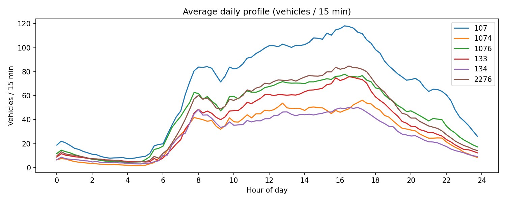

# Gothenburg Traffic Simulation

Traffic flow animation, ML forecasting and incident (road closure) simulation
for Gothenburg's inner city. Six real traffic sensors, 15-minute vehicle
counts for all of 2025, provided by Göteborgs Stad. Summer project at
Chalmers (supervisor: Prof. Miroslaw Staron).

## What it does

1. **Animate** historical traffic on a real map of Gothenburg (done)
2. **Forecast** normal flow with an ML model, exported as a 2027 forecast (done)
3. **Simulate** traffic after incidents / road closures with SUMO (done —
   calibrated demand, closure rerouting incl. time-windowed closures, Monte
   Carlo confidence, multi-day/week scenarios, scenario mode in the web app)
4. **Suggest** the least-disruptive time to close a road (implemented — the
   default proxy-ranked search is fast; `--exhaustive` evaluates every
   feasible window before making a global-best claim)



## Scope

The canvas is Gothenburg's **inner city** (river → Krokslätt, Vallgraven →
Gårda; ~7 100 directed edges) — not the whole city, and no longer just the
two original sensor clusters (that scope was superseded 2026-07-05). Only 6
sensors exist, so accuracy is a **gradient**: hard/measured near a sensor,
prior-driven further away. Every edge carries a `confidence` value (0–1) —
`exp(-d²/2σ²)`, with σ fitted from real leave-one-station-out validation
(currently 144.0 m), not a guessed constant — that decays with distance from
the nearest sensor. The web app shows it on hover; simulation results are
presented with it rather than a false claim of citywide accuracy.

| Cluster | Sensors | Type |
|---|---|---|
| Götaplatsen (near Viktor Rydbergsgatan) | 133, 134, 2276 | Single direction |
| Scandinavium | 1074, 1076 | Single direction |
| Scandinavium | 107 | Genuinely two-way (both directions measured) |

Direction is **not** recoverable from the delivered two-way totals for the
5 single-direction sensors — every "Total" value is treated as a sum of both
directions permanently. A trained model (see `dirsplit/` below) estimates
the split for simulation purposes; it is disclosed as an estimate, not a
measurement.

## Architecture

Two halves that never mix:

- **Offline (Python)** builds static artifacts:
  `build_data.py` → `network.geojson` + `flows.json` + `graph.graphml`
  → `build_features.py` → feature matrices + `normal_profile.json`
  → `train_agent1.py` → per-sensor models → `build_agent1_flows.py` → `flows_forecast.json`
- **Runtime (browser)** is a static Leaflet app (`web/`); `serve.py` adds an
  optional local API for on-demand closures/recalibration (feature-detected —
  the app still works fully static without it, just without those two
  actions).

The renderer only ever calls `flowAt(edgeId, quarterIndex)` — the provider
seam. Historical data, the forecast, and SUMO scenarios all plug in behind
the same interface without touching map/render code.

## Running

```bash
pip install -r requirements.txt

# Full pipeline (auto-discovers data_in/, falls back to the original delivery)
make all

# Web app + scenario API → http://localhost:8000
make serve
```

**Close roads from the map:** with `make serve` running, click **🚧 Stäng väg**,
select any streets on the map, and hit *Simulera* — the server runs the SUMO
Monte Carlo on demand (~1 min) and the map switches to the resulting scenario,
closed edges drawn black-dashed and diverted traffic recoloured. Multiple
simultaneous closures are supported (`run_scenario.py --close e1 e2 …` from
the CLI does the same), and closures can be time-windowed (open again after
a stated end time) rather than only whole-run.

**Simulating more than one day:** `build_sumo_demand.py --start-date
YYYY-MM-DD --days N` (N up to 7) builds one continuous multi-day demand
instead of a single day; `/api/recalibrate?date=&days=N` does the same from
the web UI's "Byt dag" panel. Candidate route geometry is pooled by weekday/
weekend, not regenerated per day, so a week costs roughly proportionally
more than one day, not N times more — see `IMPROVEMENT_PLAN.md` for measured timings.
Per-scenario trajectory (individual-vehicle) export defaults off above one
day (file size); pass `--trajectories` to force it on.

**Feeding it new data:** drop new quarterly sensor CSVs in `data_in/`
(see `data_in/README.md`), verify the station's measured direction in the
city's traffic catalogue, add its metadata to `data_in/sensors.json`, and run
`make refresh` — the new sensor gets an edge on the map, a coverage check,
its own direction model and a place in the demand calibration automatically.

Web app controls: play/scrub 2025 traffic, toggle to the 2027 forecast or a
SUMO scenario, space = play/pause, ←/→ = ±15 min, Shift+←/→ = ±1 day. Hover
any road for counts and simulation confidence.

## Incident simulation (SUMO)

```bash
make sumo-net    # graph.graphml → SUMO network (edge IDs identical to the map)
make demand      # direction-split estimate + calibrate demand against the 6 sensors
make scenario    # baseline + a Skånegatan closure, 3 Monte Carlo seeds each
# custom closure:
python3 run_scenario.py --close <edgeId>
```

Demand calibration is a 4-level hierarchy
(`traffic_sim/demand/pfe.py`, `observability.py`, `assignment_priors.py`,
`prior_flows.py`): hard measured counts, mathematical
conservation bounds (junction/corridor), a structural gravity/stochastic-
multipath assignment field (Dial-style, the missing "4th step" of the
classic 4-step transport model), and entropy-maximising route-flow solving
(IPF/Bregman balancing) so flow disperses across realistic alternative
routes instead of collapsing onto one canonical path. Validated by
leave-one-station-out cross-validation (`python3 validate_sim.py` →
`web/data/loso_report.json`) — the honest empirical answer to "how wrong is
the program on a street it can't see."

Closed edges reroute live in SUMO; a vehicle with genuinely no detour around
a closure has its route truncated at the last reachable edge (it drives most
of the trip and "parks" short of the closure) rather than being deleted
outright or silently teleported through the closed edge. Disruption quality
for a closure (`closure_metrics.py`) is scored primarily by Δ total
`timeLoss` against a same-demand baseline, with teleports and stranded
vehicles as hard disqualifying guards — GEH (sensor-fit) is deliberately
**not** used here, since it's blind to waiting time.

Every SUMO network build also writes `sumo/network_audit.json`, a provenance
sidecar showing imported versus defaulted speed/lane values, movement and
restriction tags, roundabouts, and the TLS membership produced by netconvert.
Golden artifacts can be staged and activated through `release_registry.py`.
Each normal/closure/signal case is an integrity-checked bundle, so its scenario,
trajectory and exact route inputs cannot drift independently. Activation
requires an explicit validation record and can be rolled back by a single
pointer flip.

**Direction & OD estimation.** The calibrated routes are aggregated into an
origin–destination matrix over zones (inner-city sub-areas + eight compass
entry sectors) → `web/data/od_matrix.json`/`.csv`. Both the direction split
and the OD matrix are estimates and labelled as such: the true direction
split and OD are not identifiable from six counting points.

## Trained direction-split model (`dirsplit/`, deployed)

Instead of guessing the split, a model is trained on cities where hourly
**directional** counts are open data: Statens vegvesen's
[trafikkdata API](https://trafikkdata.atlas.vegvesen.no/om-api) (394 stations
in Oslo, Bergen, Trondheim, Stavanger). One shared feature pipeline describes
every directed edge — road class, speed, lanes, toward-centre alignment,
residential streets behind vs destinations ahead — identically for Norwegian
stations and Gothenburg sensor edges, so adding a sensor requires nothing but
a row in `network.geojson`. Station directions arrive as place names; they
are resolved to bearings by geocoding + road-axis matching with a consistency
requirement, and ambiguous stations are excluded (all decisions stored for
audit). An applicability-domain check (kNN in standardized feature space)
verifies the Gothenburg edges lie inside the training distribution before any
prediction is trusted.

**Deployed finding:** real two-way city streets are only *mildly* asymmetric
— typical weekday deviation from 50/50 is 5–8 percentage points (e.g. 55/45),
not the 80/20 an earlier, unvalidated Gaussian AM/PM heuristic
(`estimate_directions.py`, kept only as a fallback when the trained model is
absent) assumed. Predictions are James-Stein-shrunk toward 50/50 (only
~26% of the raw predicted deviation is treated as transferable signal,
calibrated against pooled leave-city-out error) and reported as q10/q50/q90
— the three build three separate demand variants, and Monte Carlo seeds are
spread across them so direction uncertainty reaches the displayed confidence.

```bash
make dirsplit-stations   # station metadata (open API, no key)
make dirsplit-volumes    # hourly volumes by direction (resumable)
make dirsplit-match      # OSM matching + heading→bearing resolution
make dirsplit-dataset    # assemble the shared training table
make dirsplit-train      # per-sensor locally-weighted LightGBM quantile models
make dirsplit-predict    # → sumo/direction_split.json (edge_shares_q10/q50/q90)
make dirsplit-coverage   # are our sensor edges inside the training cloud?
```

`make demand` automatically prefers the trained model over the Gaussian
fallback whenever `data/dirsplit/model.pkl` exists.

Scenarios appear under the **Simulering** toggle in the web app: every
simulated street is coloured by flow (including a genuine, honest zero —
not hidden as missing data), the closed edge is drawn black-dashed, and each
edge's confidence combines the distance-to-sensor prior with the spread
across Monte Carlo seeds and direction-split variants.

## Forecast model ("Agent 1")

LightGBM baseline (7 cyclic time features, trained on non-holiday days only)
+ **Holiday Baseline Adjustment**: per-sensor factors
`actual_2025 / baseline_prediction` for 15 Swedish holidays. The baseline
handles the day-of-week shift between years; the factor captures the holiday
effect itself (e.g. the New Year's Eve midnight spike) with no manual
corrections, except when a mapped holiday's 2027 date falls on a *different*
day-of-week than its 2025 source (e.g. Första maj, Thursday in 2025 but
Saturday in 2027) — `build_agent1_flows.py`'s `dow_correction_ratios`
corrects for that specific mismatch.

Cross-validated MAE beats the seasonal-naïve baseline by 12–29 % on all six
sensors (non-holiday days). Note: holiday factors are calibrated, not
cross-validated — with a single year of data each holiday is observed once.

## Repository layout

```
traffic_sim/
  core/                 shared contracts and content fingerprints
  intake/               sensor registry and data-intake helpers
  demand/               PFE solver/kernel and candidate-artifact cache
  confidence/           held-out validation and validation reporting
  simulation/           SUMO runtime, network metadata/audits, disruption metrics
  ops/                  run and release registries

build_data.py           intake CLI -> network.geojson, flows.json, graph.graphml
build_features.py       flow matrix, adjacency, normal profile and splits
build_dataset.py        windowed datasets for a future GNN
train_agent1.py         LightGBM baseline + holiday factors
build_agent1_flows.py   2027 forecast -> flows_forecast.json
build_sumo_net.py       graph.graphml -> SUMO network (stable edge IDs)
build_candidates.py     DeSO/OSM/RVU-grounded candidate routes
build_sumo_demand.py    demand orchestration and calibrated SUMO routes
run_scenario.py         baseline/closure Monte Carlo runs
serve.py                static web + optional local API
observability.py,       demand-estimation stages (root CLI modules)
assignment_priors.py,
prior_flows.py
pfe.py, pfe_kernel.py   compatibility imports for traffic_sim/demand/
validate_sim.py         stable CLI wrapper for traffic_sim/confidence/loso.py
validation_report.py    stable CLI wrapper for traffic_sim/confidence/report.py
dirsplit/               trained direction-split model package
demand/                 demand model components and data contracts
web/                    static Leaflet browser runtime
web/data/               generated artifacts and exact graph snapshot
data_in/                user-delivered sensor/DeSO/POI inputs
sumo/, runs/, cache/    generated intermediates, manifests and caches
tools/                  bounded experiments and probes
tests/                  contract + pipeline tests
ARCHITECTURE.md         structural source of truth
IMPROVEMENT_PLAN.md     canonical improvement and delivery plan
```

Former shared root modules remain compatibility imports or CLI wrappers
pointing at `traffic_sim/`; they are intentionally not duplicate source. Run existing
commands from the repository root so relative artifact paths and Makefile
contracts remain deterministic.
